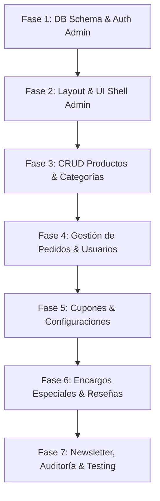

# Plan Arquitectónico y Especificación Modular del Panel de Administración — Yamgurumi

> **Proyecto**: Yamgurumi (E-commerce de Amigurumis y Tejidos Artesanales a Mano)  
> **Tech Stack**: Next.js 16 (App Router), React 19, TypeScript, Tailwind CSS v4, Prisma 7 + PostgreSQL, Jose (JWT Auth), Upstash Redis, Resend (Emails), Zustand, Zod.  
> **Ubicación del Documento**: `ADMIN_PLAN.md` (Raíz del proyecto)  
> **Objetivo**: Proporcionar una guía técnica, completa y detallada para el desarrollo de todo el módulo de administración y la reestructuración de la base de datos con Prisma, garantizando el contexto completo en cualquier sesión de trabajo.

---

## 1. Visión General del Módulo de Administración

El módulo de administración de **Yamgurumi** es una plataforma centralizada y segura diseñada para gestionar el catálogo de productos artesanales, categorías, pedidos de clientes, cupones promocionales, encargos personalizados de amigurumis, suscriptores y configuraciones globales de la tienda.

### Principales Pilares del Módulo:
1. **Seguridad y Control de Acceso Estricto**: Acceso exclusivo para usuarios con rol `ADMIN`.
2. **Base de Datos Dinámica y Escalable con Prisma**: Transición del mock de datos estáticos en `data/products.ts` a una estructura relacional limpia en PostgreSQL.
3. **Experiencia de Usuario Reaccional y Fluida**: Interfaz construida con Server Components y Client Components interactivos, tablas dinámicas con filtros instantáneos y modales de edición.
4. **Gestión Integral del Ciclo de Vida del E-Commerce**: Desde la creación de productos y categorías hasta el procesamiento de pedidos, generación de facturas/etiquetas y soporte a solicitudes a medida.

---

## 2. Autenticación, Roles y Seguridad de Administración

### 2.1. Credenciales y Flujo de Login Administrador
- **Ruta de Acceso**: `/admin/login` (o login estándar en `/auth/login` que detecta rol `ADMIN` y redirige a `/admin`).
- **Validación de Credenciales**:
  - El usuario ingresa `email` y `password`.
  - El backend procesa las credenciales mediante `loginAction` (`src/actions/auth/login.ts`), verificando la contraseña encriptada con `bcryptjs`.
  - Se valida explícitamente que `user.role === 'ADMIN'`. Si el usuario tiene rol `CUSTOMER`, no podrá acceder al área de administración y será redirigido a la tienda pública con un mensaje descriptivo.
- **Cuentas de Administrador Existentes en Seed**:
  - En `prisma/seed.ts` se encuentran registradas las cuentas administrativas predeterminadas (`admin@yamgurumi.com` y `cb2724136@gmail.com` con rol `ADMIN`).

### 2.2. Protección de Rutas con Middleware (`middleware.ts`)
- **Protección a Nivel de Enrutado**:
  - Todas las rutas `/admin/:path*` (excepto `/admin/login`) están interceptadas por `middleware.ts`.
  - El middleware valida el token JWT (`auth_token`) de la cookie `httpOnly`.
  - Si no hay token o caducó $\rightarrow$ Redirección a `/auth/login?redirect=/admin`.
  - Si el token existe pero `payload.role !== 'ADMIN'` $\rightarrow$ Redirección a `/` (Inicio de tienda).
  - Inyección de headers de contexto (`x-user-id`, `x-user-role`).

### 2.3. Helper de Seguridad para Server Actions
- Se creará un helper reusable `requireAdmin()` en `src/lib/auth/adminGuard.ts`:
  ```typescript
  import { getAuthCookie, verifyToken } from '@/src/lib/auth/tokens';
  import { Role } from '@prisma/client';

  export async function requireAdmin() {
    const token = await getAuthCookie();
    if (!token) throw new Error('No autorizado');
    const payload = await verifyToken(token);
    if (!payload || payload.role !== Role.ADMIN) {
      throw new Error('Acceso denegado: se requieren permisos de administrador');
    }
    return payload;
  }
  ```

---

## 3. Plan Detallado de Base de Datos y Prisma Schema

Actualmente, las órdenes, usuarios y cupones básicos están en `prisma/schema.prisma`. El catálogo de productos y categorías reside temporalmente en un archivo TypeScript estático (`data/products.ts`).

Para activar el panel de administración con **operaciones CRUD reales y persistentes**, se ejecutará una reestructuración profunda del esquema de base de datos.

### 3.1. Modificaciones a Modelos Existentes

1. **Modelo `User`**:
   - Añadir relaciones inversas con nuevos modelos: `reviews ProductReview[]`, `customOrders CustomOrderRequest[]`, `auditLogs AuditLog[]`.
2. **Modelo `DiscountCode`**:
   - Extender el modelo actual para soportar tanto descuentos porcentuales como montos fijos en dinero:
     - `discountType`: Enum (`PERCENTAGE`, `FIXED_AMOUNT`).
     - `amount`: `Decimal? @db.Decimal(10, 2)` (Monto fijo si aplica).
     - `minPurchaseAmount`: `Decimal? @db.Decimal(10, 2)` (Compra mínima requerida).
     - `isActive`: `Boolean @default(true)`.
     - `startDate`: `DateTime @default(now())`.
3. **Modelo `Order`**:
   - Conectar con los ítems comprados mediante `items OrderItem[]`.
   - Añadir campos de seguimiento y logística:
     - `trackingNumber`: `String?` (Número de guía de envío).
     - `paymentMethod`: `String @default("WHATSAPP")` (WhatsApp, Transferencia, Tarjeta).
     - `adminNotes`: `String? @db.Text` (Notas internas del equipo administrativo).
4. **Modelo `Favorite`**:
   - Convertir la propiedad `productId` en una relación de clave foránea real con el nuevo modelo `Product`: `product Product @relation(fields: [productId], references: [id], onDelete: Cascade)`.

---

### 3.2. Nuevos Modelos y Enums a Incorporar en `prisma/schema.prisma`

```prisma
// ===== NUEVOS ENUMS =====
enum DiscountType {
  PERCENTAGE
  FIXED_AMOUNT
}

enum CustomOrderStatus {
  PENDING
  QUOTED
  ACCEPTED
  IN_PRODUCTION
  COMPLETED
  CANCELLED
}

// ===== MODELO DE CATEGORÍAS =====
model Category {
  id          String    @id @default(cuid())
  name        String    @unique
  slug        String    @unique
  icon        String?   // Emoji o identificador de icono (ej: "🧸", "🏡")
  description String?   @db.Text
  imageUrl    String?
  sortOrder   Int       @default(0)
  isActive    Boolean   @default(true)
  createdAt   DateTime  @default(now())
  updatedAt   DateTime  @updatedAt

  products    Product[]

  @@index([slug])
  @@index([isActive])
}

// ===== MODELO DE PRODUCTOS =====
model Product {
  id             String    @id @default(cuid())
  name           String
  slug           String    @unique
  price          Decimal   @db.Decimal(10, 2)
  salePrice      Decimal?  @db.Decimal(10, 2)
  stock          Int       @default(10)
  categoryId     String
  category       Category  @relation(fields: [categoryId], references: [id], onDelete: Restrict)
  size           String    @default("Mediano") // Mini, Mediano, Grande
  description    String    @db.Text
  materials      String    @db.Text           // Hilo de algodón hipoalergénico, vellón siliconado, etc.
  tags           String[]  @default([])       // ["regalo", "kawaii", "nuevo"]
  imageUrls      String[]  @default([])       // Galería de imágenes (URLs)
  isFeatured     Boolean   @default(false)
  isActive       Boolean   @default(true)
  rating         Float     @default(5.0)
  reviewsCount   Int       @default(0)
  createdAt      DateTime  @default(now())
  updatedAt      DateTime  @updatedAt

  favorites      Favorite[]
  reviews        ProductReview[]
  orderItems     OrderItem[]

  @@index([slug])
  @@index([categoryId])
  @@index([isActive, isFeatured])
}

// ===== DETALLE DE PRODUCTOS EN PEDIDOS =====
model OrderItem {
  id        String   @id @default(cuid())
  orderId   String
  order     Order    @relation(fields: [orderId], references: [id], onDelete: Cascade)
  productId String
  product   Product  @relation(fields: [productId], references: [id], onDelete: Restrict)
  name      String
  price     Decimal  @db.Decimal(10, 2)
  quantity  Int
  size      String?

  @@index([orderId])
  @@index([productId])
}

// ===== RESEÑAS Y VALORACIONES =====
model ProductReview {
  id         String   @id @default(cuid())
  productId  String
  product    Product  @relation(fields: [productId], references: [id], onDelete: Cascade)
  userId     String?
  user       User?    @relation(fields: [userId], references: [id], onDelete: SetNull)
  userName   String
  rating     Int      // 1 a 5 estrellas
  comment    String   @db.Text
  isApproved Boolean  @default(false)
  adminReply String?  @db.Text
  createdAt  DateTime @default(now())

  @@index([productId])
  @@index([isApproved])
}

// ===== SOLICITUDES DE AMIGURUMIS PERSONALIZADOS =====
model CustomOrderRequest {
  id              String            @id @default(cuid())
  userId          String?
  user            User?             @relation(fields: [userId], references: [id], onDelete: SetNull)
  customerName    String
  email           String
  phone           String
  title           String
  description     String            @db.Text
  desiredSize     String?           // Mini, Mediano, Gigante
  budgetRange     String?
  referenceImages String[]          @default([])
  status          CustomOrderStatus @default(PENDING)
  quotedPrice     Decimal?          @db.Decimal(10, 2)
  adminNotes      String?           @db.Text
  createdAt       DateTime          @default(now())
  updatedAt       DateTime          @updatedAt

  @@index([status])
  @@index([email])
}

// ===== CONFIGURACIONES GLOBALES DE LA TIENDA =====
model StoreSetting {
  id          String   @id @default(cuid())
  key         String   @unique // ej: "store_phone", "shipping_flat_rate", "top_banner_text"
  value       String   @db.Text
  description String?
  category    String   @default("general") // general, shipping, payment, notification
  updatedAt   DateTime @updatedAt

  @@index([key])
}

// ===== BITÁCORA DE AUDITORÍA Y REGISTRO DE ACTIVIDAD =====
model AuditLog {
  id        String   @id @default(cuid())
  userId    String
  userEmail String
  action    String   // "CREATE_PRODUCT", "UPDATE_ORDER_STATUS", "DELETE_COUPON"
  entity    String   // "Product", "Order", "DiscountCode"
  entityId  String?
  details   String?  @db.Text
  ipAddress String?
  createdAt DateTime @default(now())

  @@index([userId])
  @@index([createdAt])
}
```

---

### 3.3. Plan de Migración y Sembrado de Datos (Migration & Seeding)

1. **Generación de Migración Prisma**:
   ```bash
   npx prisma migrate dev --name add_admin_and_catalog_models
   ```
2. **Script de Migración de Datos (`prisma/seed.ts`)**:
   - Se actualizará `prisma/seed.ts` para importar automáticamente todas las categorías y productos de `data/products.ts` e insertarlos en la base de datos PostgreSQL.
   - Las 8 categorías actuales (`Muñecos`, `Decoración`, `Accesorios`, `Llaveros`, `Navideño`, `Infantil`, `Plantas & Flores`, `Anime & Fanart`) se crearán dinámicamente con sus slugs e iconos.
   - Los productos se asociarán a sus respectivas categorías, preservando precios, imágenes, tamaños y tags.
3. **Creación del Comando de Reseteo y Sembrado**:
   - `npm run db:seed` para ejecutar la carga de datos.

---

### 3.4. Server Actions de Base de Datos para la Administración

Se organizarán los Server Actions en la carpeta `src/actions/admin/`:

- `src/actions/admin/products.ts`:
  - `getAdminProducts(params)`: Lista paginada con filtros.
  - `createProduct(formData)`: Creación con validación Zod.
  - `updateProduct(id, formData)`: Edición de campos.
  - `deleteProduct(id)`: Borrado suave/físico.
  - `toggleProductStatus(id)`: Activar/Desactivar visibilidad.
- `src/actions/admin/categories.ts`:
  - `getAdminCategories()`: Lista con contador de productos.
  - `createCategory(data)`: Crear categoría.
  - `updateCategory(id, data)`: Actualizar información de categoría.
  - `deleteCategory(id)`: Eliminar previa validación de productos vinculados.
- `src/actions/admin/coupons.ts`:
  - `getAdminCoupons()`: Lista de promociones.
  - `createCoupon(data)`: Crear cupón porcentaje o monto fijo.
  - `updateCoupon(id, data)`: Editar condiciones.
  - `toggleCouponStatus(id)`: Activar/Inactivar cupón.
  - `deleteCoupon(id)`: Eliminar cupón.
- `src/actions/admin/orders.ts`:
  - `getAdminOrders(status, search)`: Filtro por estado.
  - `updateOrderStatus(orderId, status, trackingNumber)`: Cambio de estado con notificación email vía Resend.
  - `saveAdminOrderNotes(orderId, notes)`: Guardar notas internas.
- `src/actions/admin/users.ts`:
  - `getAdminUsers()`: Lista de clientes y administradores.
  - `updateUserRole(userId, role)`: Asignación de rol `CUSTOMER` o `ADMIN`.
- `src/actions/admin/custom-orders.ts`:
  - `quoteCustomOrder(id, price, notes)`: Enviar presupuesto al cliente.
  - `updateCustomOrderStatus(id, status)`: Actualizar avance del tejido.
- `src/actions/admin/reviews.ts`:
  - `approveReview(id)`, `rejectReview(id)`, `replyToReview(id, replyText)`.
- `src/actions/admin/settings.ts`:
  - `updateStoreSettings(settingsArray)`: Guardar pares clave-valor de configuración.
- `src/actions/admin/audit.ts`:
  - `logAdminAction(...)`: Registrar evento en `AuditLog`.

---

## 4. Estructura de Rutas y Layout del Panel (`/app/admin/`)

```
app/
└── admin/
    ├── layout.tsx                 # Layout principal con Sidebar + Navbar Admin
    ├── page.tsx                   # Seccion 1: Dashboard Principal
    ├── productos/
    │   ├── page.tsx               # Seccion 2: Listado y CRUD Productos
    │   ├── nuevo/page.tsx         # Formulario Creación Producto
    │   └── [id]/editar/page.tsx   # Formulario Edición Producto
    ├── categorias/
    │   └── page.tsx               # Seccion 3: CRUD Categorías
    ├── cupones/
    │   └── page.tsx               # Seccion 4: CRUD Cupones y Promociones
    ├── configuracion/
    │   └── page.tsx               # Seccion 5: Configuraciones Generales
    ├── pedidos/                   # SECCIÓN SUGERIDA 1: Gestión de Pedidos
    │   ├── page.tsx               # Listado de Pedidos
    │   └── [id]/page.tsx          # Detalle y cambio de estado de Pedido
    ├── usuarios/                  # SECCIÓN SUGERIDA 2: Gestión de Clientes/Admins
    │   └── page.tsx
    ├── encargos/                  # SECCIÓN SUGERIDA 3: Pedidos a Medida / Personalizados
    │   └── page.tsx
    ├── resenas/                   # SECCIÓN SUGERIDA 4: Moderación de Reseñas
    │   └── page.tsx
    ├── newsletter/                # SECCIÓN SUGERIDA 5: Suscriptores y Emailing
    │   └── page.tsx
    ├── auditoria/                 # SECCIÓN SUGERIDA 6: Registro de Actividad
    │   └── page.tsx
    └── reportes/                  # SECCIÓN SUGERIDA 7: Exportación e Informes
        └── page.tsx
```

---

## 5. Detalle Exhaustivo de Secciones

### SECCIÓN 1: Dashboard General (`/admin`)
* **Objetivo**: Brindar un resumen de control en tiempo real sobre la salud financiera y operativa del negocio.
* **Componentes**:
  1. **Tarjetas KPI (Resumen Ejecutivo)**:
     - Ingresos Totales del Mes (con % de variación vs mes anterior).
     - Pedidos Pendientes por Procesar / Enviar.
     - Total de Productos Activos y Alerta de Stock Bajo ($< 3$ unidades).
     - Clientes Registrados y Suscriptores de Newsletter.
  2. **Gráficos Interactivos**:
     - *Gráfico de Ventas Mensuales*: Evolución de ingresos (Chart con datos de `Order`).
     - *Gráfico de Distribución por Categoría*: Qué categorías generan más pedidos.
  3. **Tabla de Pedidos Recientes**:
     - Últimos 5 pedidos recibidos con estado, cliente, total y botón de acción rápida para confirmar o ver detalles.
  4. **Panel de Alertas Operativas**:
     - Avisos de productos agotados o a punto de agotarse.
     - Alertas de nuevas solicitudes de Amigurumis Personalizados pendientes de cotización.

---

### SECCIÓN 2: Gestión de Productos — CRUD (`/admin/productos`)
* **Objetivo**: Administrar el catálogo completo de amigurumis y artículos tejidos.
* **Funcionalidades**:
  1. **Tabla de Productos Interactiva**:
     - Búsqueda en tiempo real por nombre, tag o SKU.
     - Filtro por Categoría, Tamaño (Mini, Mediano, Grande) y Estado (Activo/Inactivo/Agotado).
     - Paginación y ordenamiento por Precio, Fecha de creación o Stock.
  2. **Formulario de Creación y Edición**:
     - **Campos Generales**: Nombre, Slug (autogenerado con botón de edición manual), Categoría (select dinámico), Tamaño.
     - **Precios e Inventario**: Precio Normal, Precio de Oferta (salePrice opcional), Cantidad en Stock.
     - **Descripción y Detalles**: Descripción detallada, Materiales utilizados (ej. hilo de algodón 100% hipoalergénico, ojos de seguridad), Tags/Etiquetas (añadir con tecla Enter).
     - **Galería de Imágenes**: Carga de imágenes con vista previa, reordenamiento por arrastre y selección de imagen principal.
     - **Opciones Especiales**: Interruptor "Destacado en Home" (`isFeatured`), Interruptor "Producto Activo" (`isActive`).
  3. **Acciones del Administrador**:
     - Duplicación rápida de productos.
     - Eliminación con modal de confirmación y advertencia si el producto pertenece a pedidos existentes.
     - Edición rápida de stock e interruptor de activo directamente en la lista.

---

### SECCIÓN 3: Gestión de Categorías — CRUD (`/admin/categorias`)
* **Objetivo**: Estructurar las familias de productos (ej: Muñecos, Decoración, Accesorios, Llaveros, Navideño, Infantil, Plantas & Flores, Anime & Fanart).
* **Funcionalidades**:
  1. **Lista de Categorías**:
     - Visualización del nombre, icono emoji/SVG, slug, cantidad de productos asociados, orden de aparición y estado.
  2. **Formulario Modal / Sidebar de Categoría**:
     - Nombre de la Categoría.
     - Slug único.
     - Seleccionador de Ícono/Emoji (ej. 🧸, 🔑, 🎄, 🌸).
     - Descripción orientada a SEO.
     - Banner o Imagen de Portada de la categoría.
     - Número de Orden (`sortOrder`).
  3. **Reglas de Negocio**:
     - No se permite eliminar una categoría que tenga productos asignados activos (requiere reasignación previa).

---

### SECCIÓN 4: Administración de Cupones y Códigos Promocionales (`/admin/cupones`)
* **Objetivo**: Crear incentivos de venta mediante códigos de descuento configurables.
* **Funcionalidades**:
  1. **Lista de Cupones**:
     - Código (ej. `YAMGURUMI10`, `BIENVENIDA2026`).
     - Tipo de Descuento (% Porcentaje o $ Monto Fijo).
     - Usos realizados / Límite de usos.
     - Estado (Activo, Programado, Vencido, Agotado).
  2. **Formulario de Creación/Edición**:
     - **Código**: Input en mayúsculas con generador de códigos aleatorios.
     - **Tipo y Valor**: Selector de porcentaje (ej: 15%) o valor fijo (ej: $500).
     - **Restricciones**: Monto mínimo de compra en carrito, límite de uso total (ej. solo los primeros 50 clientes), límite por usuario.
     - **Vigencia**: Fecha y hora de inicio y expiración.
     - **Asignación exclusiva**: Posibilidad de vincular el cupón a un `userId` específico (ej. cupón de compensación o regalo de cumpleaños).
     - Toggle rápido para activar/desactivar el cupón manualmente.

---

### SECCIÓN 5: Configuraciones del Sistema (`/admin/configuracion`)
* **Objetivo**: Controlar la información institucional, parámetros operativos y canales de comunicación de Yamgurumi.
* **Estructura en Pestañas (Tabs)**:
  1. **Pestaña 1: Información de la Tienda**:
     - Nombre de la tienda, eslogan, email de contacto principal, número de teléfono y enlace directo de WhatsApp Business.
     - Enlaces a redes sociales (Instagram, TikTok, Facebook, Pinterest).
  2. **Pestaña 2: Métodos de Envíos y Costos**:
     - Configuración de Costo Fijo de Envío (Flat rate).
     - Umbral de Envío Gratis (ej. "Envío gratis en compras mayores a $15,000").
     - Zonas de entrega configurables y tiempos estimados de despacho (ej. "3 a 5 días hábiles para confección").
  3. **Pestaña 3: Checkout y Pagos**:
     - Activar/Desactivar Checkout por WhatsApp (enviar pedido directamente a chat de WhatsApp).
     - Configuración de datos para Transferencia Bancaria (CBU/Alias, Banco, Titular) mostrados en la pantalla de confirmación.
  4. **Pestaña 4: Correos Transaccionales (Resend)**:
     - Configuración del email remitente (`envios@yamgurumi.com`).
     - Activar/desactivar notificaciones automáticas: Correo al cliente cuando se confirma pedido, correo cuando se marca como enviado, aviso al administrador ante nuevo pedido.
  5. **Pestaña 5: Avisos y Anuncios Web**:
     - Mensaje de la Barra de Anuncios Superior (Top Notification Bar), ej: *"🧵 ¡Todos los muñecos son 100% hechos a mano! Envíos a todo el país"*.

---

## 6. Secciones Extra Sugeridas (Alto Valor Agregado)

Para convertir el panel de administración en una herramienta completa y profesional para Yamgurumi, se proponen las siguientes **7 secciones adicionales**:

### 🌟 SECCIÓN SUGERIDA 6.1: Gestión de Pedidos / Órdenes (`/admin/pedidos`)
* **¿Por qué es vital?**: Yamgurumi ya cuenta con un modelo `Order` en la base de datos. Administrar las compras es la tarea principal del negocio.
* **Funcionalidades**:
  - **Filtro por Estados**: `PENDING` (Pendiente), `CONFIRMED` (Pago confirmado), `SHIPPED` (Enviado), `DELIVERED` (Entregado), `CANCELLED` (Cancelado).
  - **Detalle del Pedido**: Datos del cliente, dirección, método de entrega, desglose de productos comprados con fotos miniatura, subtotal, descuento aplicado y total.
  - **Cambio de Estado con Notificación**: Al cambiar el estado a `SHIPPED`, se abre un modal para ingresar el número de seguimiento y enviar un correo automático al cliente vía Resend.
  - **Impresión de Hoja de Embalaje / Factura Simple**: Generación de vista limpia o PDF con la dirección y lista de productos para adjuntar al paquete tejido.
  - **Acción Rápida de WhatsApp**: Botón directo para iniciar chat con el cliente cargando el mensaje preformateado sobre su pedido.

---

### 🌟 SECCIÓN SUGERIDA 6.2: Gestión de Usuarios y Clientes (`/admin/usuarios`)
* **¿Por qué es vital?**: Permite conocer la base de clientes y administrar roles administrativos de forma segura.
* **Funcionalidades**:
  - Listado de usuarios registrados con buscador por email o nombre.
  - Ver historial de pedidos de cada cliente y total acumulado gastado.
  - Control de Roles: Botón para promover un usuario a `ADMIN` o degradarlo a `CUSTOMER` (con doble confirmación).
  - Estado de verificación de correo electrónico.
  - Reenvío manual de correo de verificación o restablecimiento de contraseña.

---

### 🌟 SECCIÓN SUGERIDA 6.3: Solicitudes de Amigurumis a Medida / Encargos (`/admin/encargos`)
* **¿Por qué es vital?**: Los talleres artesanales de crochet reciben constantemente peticiones especiales (ej: *"¿Pueden hacer a mi mascota en amigurumi?"*).
* **Funcionalidades**:
  - Recepción de formularios de cotización donde el cliente adjunta fotos de referencia, dimensiones deseadas y descripción.
  - **Flujo de Trabajo de Cotización**:
    1. Administrador revisa la foto/idea.
    2. Define el precio cotizado (`quotedPrice`) y días estimados de confección.
    3. Al cambiar el estado a `QUOTED`, se le envía un email al cliente con el botón para aceptar y pagar el encargo personalizado.

---

### 🌟 SECCIÓN SUGERIDA 6.4: Moderación de Reseñas y Valoraciones (`/admin/resenas`)
* **¿Por qué es vital?**: Las opiniones de compradores construyen confianza en productos hechos a mano.
* **Funcionalidades**:
  - Listado de reseñas pendientes de aprobación.
  - Botones de *Aprobar*, *Rechazar* o *Eliminar*.
  - Función de **Respuesta del Administrador**: Permite escribir un mensaje oficial de agradecimiento o soporte visible bajo la reseña en la ficha del producto.

---

### 🌟 SECCIÓN SUGERIDA 6.5: Suscriptores y Email Marketing (`/admin/newsletter`)
* **¿Por qué es vital?**: El modelo `NewsletterSubscriber` ya existe en la base de datos de Yamgurumi.
* **Funcionalidades**:
  - Tabla de suscriptores con fecha de registro, origen y estado de verificación.
  - Exportación de la lista en formato CSV (compatible con Mailchimp o Klaviyo).
  - Creador de Novedades / Broadcast: Enviar un boletín por email utilizando las plantillas de React Email existentes en el proyecto.

---

### 🌟 SECCIÓN SUGERIDA 6.6: Bitácora de Auditoría y Seguridad (`/admin/auditoria`)
* **¿Por qué es vital?**: Garantiza la trazabilidad y la seguridad en caso de que existan múltiples administradores o colaboradores.
* **Funcionalidades**:
  - Registro de eventos clave: *"El usuario admin@yamgurumi.com modificó el stock del producto 'Oso Amigurumi' de 5 a 0 el 17/08/2026 14:30"*.
  - Filtro por fecha, tipo de acción y administrador.

---

### 🌟 SECCIÓN SUGERIDA 6.7: Reportes y Exportación de Datos (`/admin/reportes`)
* **¿Por qué es vital?**: Facilita la contabilidad, el balance de inventario y el control de ventas.
* **Funcionalidades**:
  - Exportación en 1-clic a CSV/Excel de:
    - Reporte de Ventas por Período (Día, Mes, Año).
    - Reporte de Productos más Vendidos y Rentabilidad.
    - Reporte de Clientes Frecuentes.

---

## 7. Plan de Ejecución por Fases de Desarrollo



### Fase 1: Base de Datos y Autenticación de Administrador
- [ ] Actualizar `prisma/schema.prisma` con los modelos `Product`, `Category`, `OrderItem`, `ProductReview`, `CustomOrderRequest`, `StoreSetting`, `AuditLog` y enums.
- [ ] Ejecutar migración de Prisma (`npx prisma migrate dev --name init_admin_models`).
- [ ] Actualizar script de seed `prisma/seed.ts` para importar y sembrar categorías y productos desde `data/products.ts` a PostgreSQL.
- [ ] Crear el helper `requireAdmin()` en `src/lib/auth/adminGuard.ts`.
- [ ] Verificar la protección de rutas en `middleware.ts`.

### Fase 2: Layout Principal del Panel Admin
- [ ] Crear `/app/admin/layout.tsx` con Sidebar colapsable, Header con perfil de usuario y breadcrumbs.
- [ ] Implementar la barra lateral de navegación con enlaces a todas las secciones (usando `react-icons`).
- [ ] Crear componentes de UI reutilizables para el panel (`AdminCard`, `AdminTable`, `AdminBadge`, `ConfirmModal`, `ImageUploader`).

### Fase 3: Módulos Core — Productos y Categorías
- [ ] **Categorías**: Implementar `/admin/categorias` (Lista, Modal Crear/Editar, Acción de eliminar con validación).
- [ ] **Productos**: Implementar `/admin/productos` (Tabla con filtros/búsqueda/paginación).
- [ ] Implementar `/admin/productos/nuevo` y `/admin/productos/[id]/editar` con carga de imágenes y generador automático de slug.
- [ ] Conectar la vista pública de catálogo (`/catalog` y `/producto/[slug]`) a la base de datos de Prisma en sustitución de los mocks estáticos.

### Fase 4: Módulos Operativos — Pedidos y Usuarios
- [ ] Implementar `/admin/pedidos` con tabla de pedidos filtrable por estado.
- [ ] Crear la vista de detalle `/admin/pedidos/[id]` con actualización de estado e integración de envíos de email vía Resend.
- [ ] Implementar `/admin/usuarios` con tabla de usuarios, asignación de roles y vista de historial de compras.

### Fase 5: Promociones y Ajustes — Cupones y Configuraciones
- [ ] Implementar `/admin/cupones` (Creación de códigos, porcentaje vs monto fijo, restricciones de uso, toggle activo).
- [ ] Implementar `/admin/configuracion` con pestañas para Ajustes Generales, Envíos, WhatsApp/Pagos, Notificaciones y Barra de Anuncios.

### Fase 6: Módulos de Valor Agregado — Encargos y Reseñas
- [ ] Implementar `/admin/encargos` para gestionar peticiones de amigurumis a medida con envío de cotizaciones.
- [ ] Implementar `/admin/resenas` para moderar comentarios y escribir respuestas oficiales.

### Fase 7: Herramientas de Control, Reportes y QA
- [ ] Implementar `/admin/newsletter` con tabla de suscriptores y exportador a CSV.
- [ ] Implementar `/admin/auditoria` para registrar acciones administrativas.
- [ ] Ejecutar pruebas de tipo (`npm run typecheck`) y pruebas de integración para asegurar cero regresiones.

---

## 8. Verificación y Criterios de Aceptación

1. **Acceso Seguro**: Ningún usuario sin rol `ADMIN` podrá acceder a ninguna URL `/admin/*` ni ejecutar Server Actions administrativas.
2. **Persistencia Dinámica**: La creación, modificación o eliminación de un producto o categoría se refleja inmediatamente en el frontend público de Yamgurumi.
3. **Manejo de Errores Robustos**: Todos los formularios cuentan con validación Zod en cliente y servidor, mostrando mensajes de error claros sin romper la aplicación.
4. **Responsiocidad y Rendimiento**: El panel de administración es totalmente adaptable a dispositivos móviles y tablets, con tiempos de carga optimizados mediante Server Components.

---
*Este plan queda registrado permanentemente en `ADMIN_PLAN.md` como referencia técnica central del proyecto Yamgurumi.*
