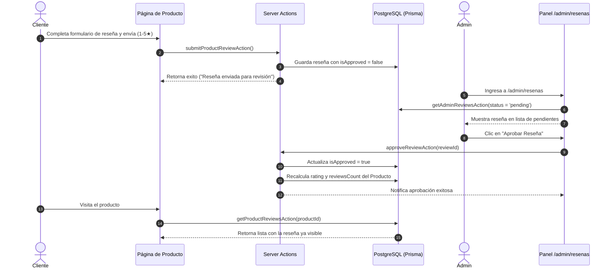

# ⭐️ Plan de Implementación: Módulo de Reseñas y Moderación (Product Reviews)

Este documento contiene la arquitectura técnica, estructura de componentes y flujo de trabajo completo para el módulo de **Reseñas de Productos y Moderación de Administrador** en **Yamgurumi Studio**.

---

## 🎯 Objetivos del Módulo

1. **Permitir a los Clientes Opinar**: Los usuarios (autenticados o visitantes) pueden enviar valoraciones de 1 a 5 estrellas con un comentario en la página de cualquier producto.
2. **Moderación de Administrador**: Ninguna reseña se publica automáticamente sin antes ser revisada y aprobada desde el panel `/admin/resenas`.
3. **Cálculo Dinámico de Calificación**: Al aprobar o eliminar una reseña, la calificación promedio (`rating`) y el contador (`reviewsCount`) del producto se recalculan automáticamente en la base de datos.
4. **Respuestas Oficiales de la Tienda**: El administrador puede publicar una respuesta oficial que se mostrará debajo del comentario del cliente.

---

## 🗄️ 1. Modelo de Datos (Prisma Schema)

El modelo `ProductReview` ya existe en `prisma/schema.prisma`. Se agregará una bandera opcional `verifiedPurchase` para distinguir compras verificadas:

```prisma
model ProductReview {
  id               String   @id @default(cuid())
  productId        String
  product          Product  @relation(fields: [productId], references: [id], onDelete: Cascade)
  userId           String?
  user             User?    @relation(fields: [userId], references: [id], onDelete: SetNull)
  userName         String
  userEmail        String?  // Para contacto interno / notificación
  rating           Int      // 1 a 5 estrellas
  comment          String   @db.Text
  isApproved       Boolean  @default(false)
  verifiedPurchase Boolean  @default(false)
  adminReply       String?  @db.Text
  createdAt        DateTime @default(now())

  @@index([productId])
  @@index([isApproved])
}
```

---

## ⚙️ 2. Server Actions (`src/actions/reviews/` & `src/actions/admin/reviews.ts`)

### A. Acciones del Cliente (`src/actions/reviews/`)
- **`submitProductReviewAction`**:
  - Recibe `{ productId, rating, comment, userName, userEmail? }`.
  - Valida que `rating` esté entre 1 y 5, y que el comentario tenga entre 10 y 500 caracteres.
  - Asocia automáticamente el `userId` si el usuario tiene una sesión activa.
  - Crea la reseña con `isApproved: false`.
  - Retorna confirmación para mostrar mensaje de agradecimiento.

- **`getProductReviewsAction`**:
  - Recibe `productId`.
  - Retorna la lista de reseñas con `isApproved: true`, ordenadas por `createdAt desc`.

### B. Acciones de Administración (`src/actions/admin/reviews.ts`)
- **`getAdminReviewsAction`**:
  - Soporta filtros: `all`, `pending`, `approved`, `rejected`.
  - Retorna reseñas paginadas con datos del producto (nombre, imagen, slug) y del cliente.

- **`approveReviewAction`**:
  - Marca `isApproved: true`.
  - Recalcula el promedio de estrellas (`rating`) y `reviewsCount` del producto y actualiza la tabla `Product`.

- **`rejectReviewAction` / `deleteReviewAction`**:
  - Cambia estado o elimina la reseña.
  - Recalcula el promedio de estrellas del producto si la reseña estaba previamente aprobada.

- **`replyToReviewAction`**:
  - Guarda `adminReply` en la reseña correspondiente.

---

## 🎨 3. Componentes de Interfaz (UI)

### A. Panel de Moderación de Administrador (`app/admin/resenas/`)
- **`app/admin/resenas/page.tsx`**: Server Component que carga métricas y reseñas iniciales.
- **`components/admin/AdminReviewsClient.tsx`**:
  - **Tarjetas KPI**:
    - Total de Reseñas.
    - Pendientes por Moderar (con badge destacado).
    - Calificación Promedio Global.
    - Reseñas Aprobadas.
  - **Filtros por Estado**: Pestañas interactivo-suaves (`Pendientes (X)`, `Aprobadas`, `Todas`).
  - **Lista de Tarjetas / Tabla de Moderación**:
    - Foto y nombre del producto con enlace a la ficha.
    - Nombre del autor, fecha y badge de `Compra Verificada` (si aplica).
    - Estrellas asignadas.
    - Texto del comentario.
    - Botones de Acción: `✓ Aprobar`, `✕ Rechazar`, `💬 Responder`, `🗑️ Eliminar`.
  - **Modal de Respuesta de Administrador**: Diálogo rápido para redactar o editar la respuesta oficial de Yamgurumi Studio.

### B. Sección de Reseñas en Página de Producto (`app/(main)/producto/[slug]/`)
- **`components/reviews/ProductReviewsSection.tsx`**:
  - **Resumen Visual de Calificación**:
    - Número grande de rating promedio (ej: `4.9 / 5`).
    - Desglose de barras porcentuales por estrella (5★, 4★, 3★, 2★, 1★).
    - Botón CTA: `✍️ Escribir una reseña`.
  - **Lista de Comentarios de Clientes**:
    - Nombre del cliente, fecha y estrellas.
    - Badge `Compra Verificada` 🧶.
    - Comentario del usuario.
    - Caja destacada con la **Respuesta Oficial de Yamgurumi Studio** (si existe).
  - **Modal / Formulario para Escribir Reseña**:
    - Selector interactivo de estrellas (hover & click).
    - Campo de Nombre.
    - Campo de Comentario.
    - Alerta informativa: *"Tu reseña será revisada por nuestro equipo antes de ser publicada."*

---

## 🔄 4. Flujo de Trabajo Completo



---

## ✅ 5. Plan de Verificación y Pruebas

1. **Pruebas de Envío**:
   - Enviar una reseña de 5 estrellas como cliente de prueba.
   - Verificar que no aparezca de inmediato en la ficha del producto hasta ser aprobada.
2. **Pruebas de Moderación Admin**:
   - Acceder como administrador a `/admin/resenas`.
   - Verificar el contador en la pestaña `Pendientes`.
   - Aprobar la reseña y verificar que la notificación de éxito se despliegue.
3. **Pruebas de Recálculo de Rating**:
   - Comprobar que `Product.rating` y `Product.reviewsCount` cambien en la base de datos y se reflejen en la tarjeta del producto del catálogo.
4. **Pruebas de Respuesta Admin**:
   - Agregar una respuesta oficial desde el panel y verificar que aparezca destacada en la ficha pública del producto.
